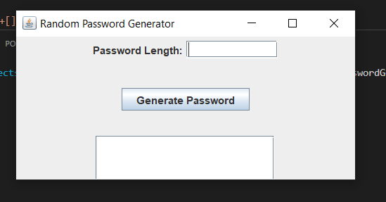
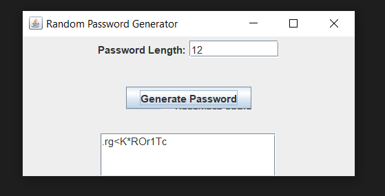

# Random Password Generator (Java)

This Java application allows you to generate random passwords with a specified length. It uses the Swing GUI library for the user interface.

## Features

- Specify the desired password length.
- Generates passwords containing symbols, digits, uppercase, and lowercase ASCII characters.
- Copies the generated password to the clipboard for easy access.

## Prerequisites

- Java Development Kit (JDK)
- A Java IDE (e.g., Eclipse, IntelliJ IDEA) for running the code

## Getting Started

1. Clone or download the repository to your local machine.

2. Open the project in your preferred Java IDE.

3. Run the `RandomPasswordGenerator.java` file.

4. The GUI will appear, allowing you to enter the password length and generate passwords.

## Usage

1. Enter the desired password length (must be at least 8 characters) in the "Password Length" field.

2. Click the "Generate Password" button.

3. The generated password will appear in the text area, and it will also be copied to your clipboard for easy use.

## Screenshots

## Contributing

Contributions are welcome! Feel free to fork this repository, make improvements, and submit pull requests.

## License

This project is licensed under the MIT License - see the [MIT License](LICENSE) file for details.

## Acknowledgments

- This project was created to demonstrate a simple Java application with a Swing GUI.
- Inspiration for the project idea came from the need for strong, random passwords in cybersecurity.
