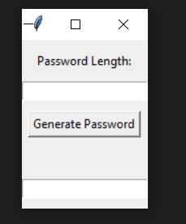
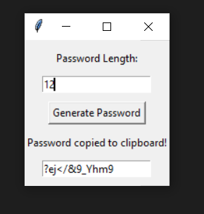

# Random Password Generator

This is a simple Python application built using the Tkinter library to create a random password generator. It generates strong passwords with symbols, digits, and both upper and lower-case ASCII letters. The generated password can also be copied to the clipboard for easy use.

## Prerequisites

Before you begin, ensure you have Python installed on your system. You'll also need to install the `pyperclip` library if you haven't already. You can do this using pip:

``` pip install pyperclip ```

## Usage
1. Clone or download this repository to your local machine.

2. Run the password_generator.py script using Python:
```python password_generator.py```

3. The application window will appear, prompting you to enter the desired password length.

4. Enter the desired length and click the "Generate Password" button.

5. The generated password will be displayed in the input field, and it will also be copied to your clipboard.

6. You can then paste the generated password wherever you need it.

## Customization
Feel free to customize the application to your needs:
- You can modify the minimum password length validation in the generate_password function.
- You can change the character sets used for password generation by adjusting the symbols, digits, lowercase_letters, and uppercase_letters variables.

## License
This project is licensed under the MIT License - see the [MIT](LICENSE) file for details.

### Acknowledgments
This project was created as a learning exercise for Python GUI programming with Tkinter.
Feel free to fork, modify, and improve upon this project as you see fit. Happy password generating!


