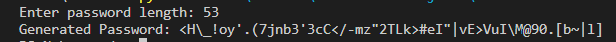

# Random Password Generator (Python)

This Python script generates random passwords with a specified length. It includes symbols, digits, and both uppercase and lowercase ASCII characters.

## Features

- Generates random passwords with a specified length.
- Passwords include symbols, digits, uppercase, and lowercase letters.
- Easy-to-use command-line interface.

## Prerequisites

- Python 3.x installed on your computer.

## Usage

1. Clone or download the repository to your local machine.

2. Open your terminal or command prompt.

3. Navigate to the directory where the script is located.

4. Run the script using the following command:
``` python generate_password.py ```

Enter the desired password length when prompted.

The script will generate a random password and display it in the terminal.

## Output 

``` Enter password length: 12
Generated Password: R#nH2kG&pZ1y
 ```
If you specify a length of less than 8 characters, the script will provide a warning.


```
Enter password length: 6
Password length should be at least 8 characters.
```
Customization
You can customize the default password length by modifying the generate_password function in the script.


```
 def generate_password(length=12):
    # ...
```
Simply change the length parameter to your preferred default length.

## License
This project is open-source and available under the MIT License. See the LICENSE file for more details.

## Acknowledgments
- This script is a simple implementation of a random password generator in Python.
- It can be a useful tool for generating secure passwords for various applications.


