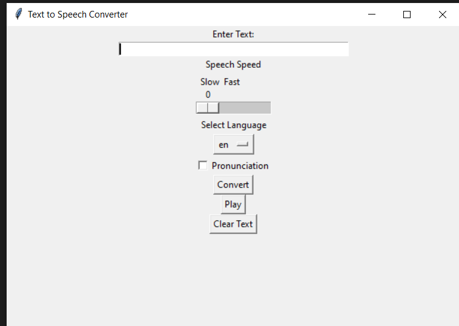

# Text-to-Speech Converter

Convert text into speech with ease using this simple Text-to-Speech Converter built in Python. This project uses the Tkinter library for the graphical user interface (GUI) and the Google Text-to-Speech (gTTS) library to generate speech from the text entered by the user.

## Features

- Convert text to speech with the click of a button.
- Adjust the speech speed to your preference.
- Select your desired language from a list of options.
- Choose whether to pronounce the text immediately or not.
- Clear the text input field for quick and easy entry of new text.
- Always create a new output audio file, with the option to overwrite existing files.

## Installation

1. Clone or download this repository to your local machine.
``` git clone https://github.com/Nrj27/text-to-speech-converter.git ```  

2. Navigate to the project directory.

 ``` cd text-to-speech-converter ``` 

3. Install the required Python libraries if you haven't already.

``` pip install gtts playsound ```
4. Run the Python script.

 ```python text_to_speech_converter.py``` 

## Usage

1. Enter the text you want to convert in the "Enter Text" field.
2. Adjust the speech speed using the "Speech Speed" scale (Slow to Fast).
3. Select your desired language from the "Select Language" dropdown menu.
4. Check the "Pronunciation" checkbox if you want the text to be pronounced immediately.
5. Click the "Convert" button to generate the speech.
    - If an output file already exists, you'll be prompted to confirm overwriting it.

6. Click the "Play" button to listen to the converted speech.
7. Use the "Clear Text" button to clear the text input field for new entries.

## License

This project is licensed under the MIT License - see the [MIT](LICENSE) file for details.

## Acknowledgments

- [Tkinter](https://docs.python.org/3/library/tkinter.html) - Python's standard GUI library.
- [gTTS (Google Text-to-Speech)](https://pypi.org/project/gTTS/) - A Python library and CLI tool to interface with Google Text-to-Speech API.
- [playsound](https://pypi.org/project/playsound/) - Pure Python implementation with no dependencies to play sound files.

## Author

- [Neeraj Rikhari](https://github.com/Nrj27)

Feel free to contribute or report issues if you find any!


